# Aegis OMS — システムフロー

## 1. 注文ステートマシン

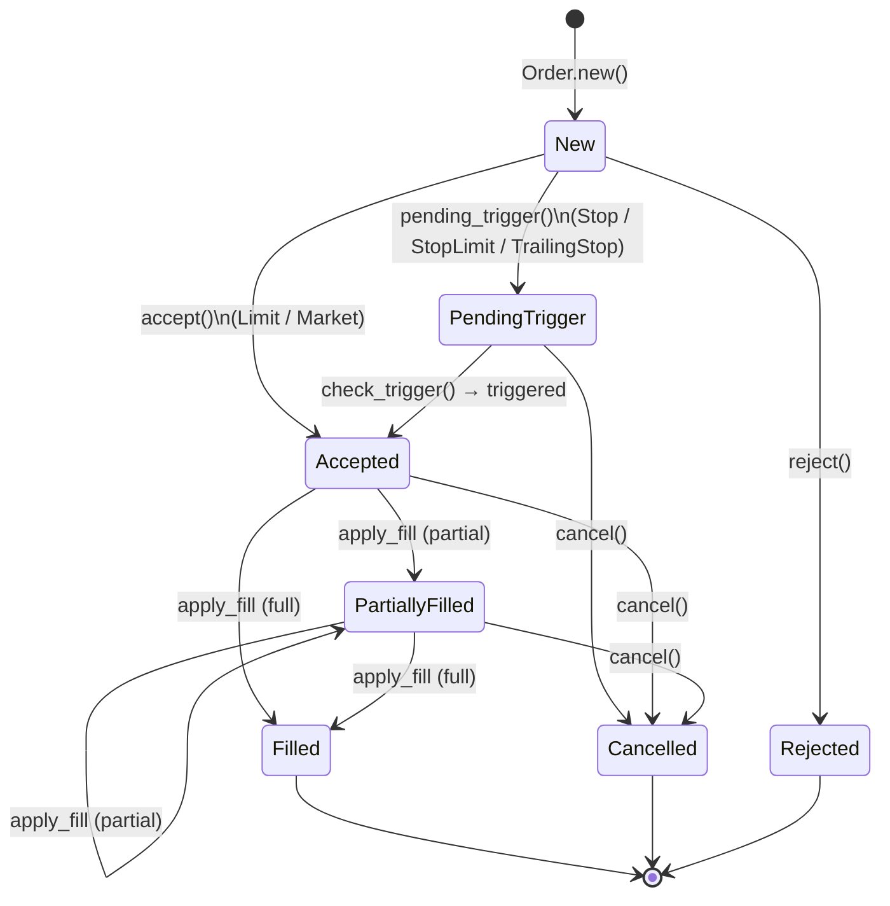
```mermaid
stateDiagram-v2
    [*] --> New : Order.new()
    New --> PendingTrigger : pending_trigger()\n(Stop / StopLimit / TrailingStop)
    New --> Accepted : accept()\n(Limit / Market)
    New --> Rejected : reject()
    PendingTrigger --> Accepted : check_trigger() → triggered
    PendingTrigger --> Cancelled : cancel()
    Accepted --> PartiallyFilled : apply_fill (partial)
    Accepted --> Filled : apply_fill (full)
    Accepted --> Cancelled : cancel()
    PartiallyFilled --> PartiallyFilled : apply_fill (partial)
    PartiallyFilled --> Filled : apply_fill (full)
    PartiallyFilled --> Cancelled : cancel()
    Filled --> [*]
    Cancelled --> [*]
    Rejected --> [*]
```

---

## 2. Limit 注文フロー（発注 → 約定）

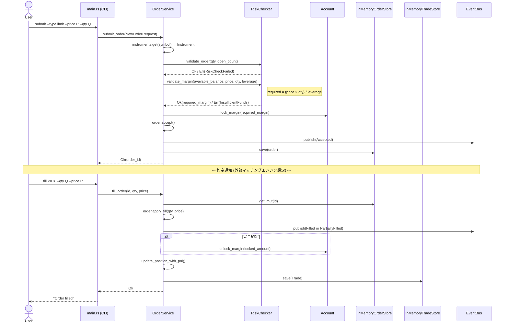
```mermaid
sequenceDiagram
    actor User
    participant CLI as main.rs (CLI)
    participant SVC as OrderService
    participant RISK as RiskChecker
    participant ACC as Account
    participant STORE as InMemoryOrderStore
    participant TS as InMemoryTradeStore
    participant BUS as EventBus

    User->>CLI: submit --type limit --price P --qty Q
    CLI->>SVC: submit_order(NewOrderRequest)

    SVC->>SVC: instruments.get(symbol) → Instrument
    SVC->>RISK: validate_order(qty, open_count)
    RISK-->>SVC: Ok / Err(RiskCheckFailed)

    SVC->>RISK: validate_margin(available_balance, price, qty, leverage)
    Note right of RISK: required = (price × qty) / leverage
    RISK-->>SVC: Ok(required_margin) / Err(InsufficientFunds)

    SVC->>ACC: lock_margin(required_margin)
    SVC->>SVC: order.accept()
    SVC->>BUS: publish(Accepted)
    SVC->>STORE: save(order)
    SVC-->>CLI: Ok(order_id)

    Note over User,BUS: --- 約定通知 (外部マッチングエンジン想定) ---

    User->>CLI: fill <ID> --qty Q --price P
    CLI->>SVC: fill_order(id, qty, price)
    SVC->>STORE: get_mut(id)
    SVC->>SVC: order.apply_fill(qty, price)
    SVC->>BUS: publish(Filled or PartiallyFilled)

    alt 完全約定
        SVC->>ACC: unlock_margin(locked_amount)
    end

    SVC->>SVC: update_position_with_pnl()
    SVC->>TS: save(Trade)
    SVC-->>CLI: Ok
    CLI-->>User: "Order filled"
```

---

## 3. Market 注文フロー（発注 → 約定）

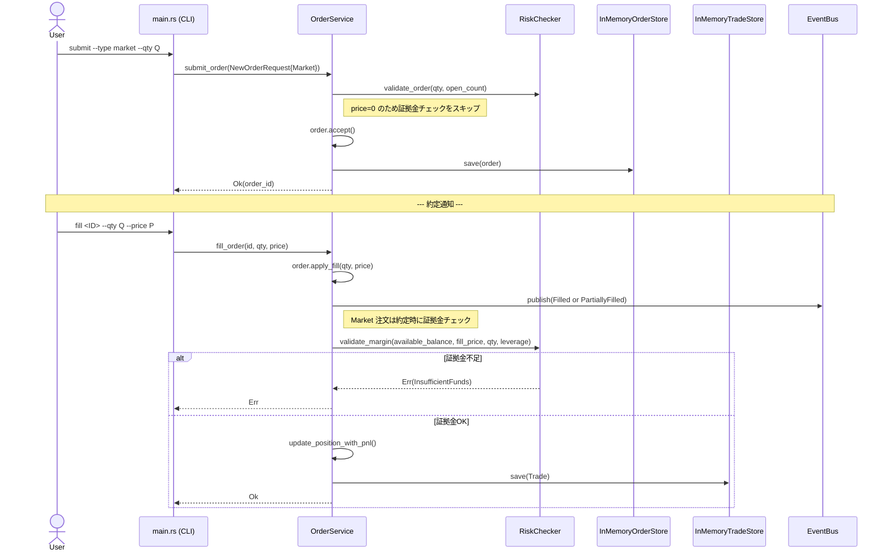
```mermaid
sequenceDiagram
    actor User
    participant CLI as main.rs (CLI)
    participant SVC as OrderService
    participant RISK as RiskChecker
    participant STORE as InMemoryOrderStore
    participant TS as InMemoryTradeStore
    participant BUS as EventBus

    User->>CLI: submit --type market --qty Q
    CLI->>SVC: submit_order(NewOrderRequest{Market})

    SVC->>RISK: validate_order(qty, open_count)
    Note right of SVC: price=0 のため証拠金チェックをスキップ
    SVC->>SVC: order.accept()
    SVC->>STORE: save(order)
    SVC-->>CLI: Ok(order_id)

    Note over User,BUS: --- 約定通知 ---

    User->>CLI: fill <ID> --qty Q --price P
    CLI->>SVC: fill_order(id, qty, price)
    SVC->>SVC: order.apply_fill(qty, price)
    SVC->>BUS: publish(Filled or PartiallyFilled)

    Note right of SVC: Market 注文は約定時に証拠金チェック
    SVC->>RISK: validate_margin(available_balance, fill_price, qty, leverage)
    alt 証拠金不足
        RISK-->>SVC: Err(InsufficientFunds)
        SVC-->>CLI: Err
    else 証拠金OK
        SVC->>SVC: update_position_with_pnl()
        SVC->>TS: save(Trade)
        SVC-->>CLI: Ok
    end
```

---

## 4. Stop / StopLimit 注文フロー

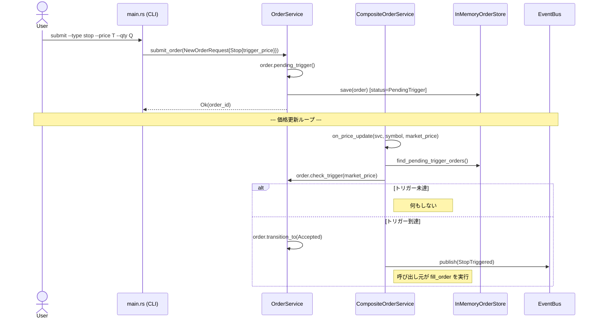
```mermaid
sequenceDiagram
    actor User
    participant CLI as main.rs (CLI)
    participant SVC as OrderService
    participant COMP as CompositeOrderService
    participant STORE as InMemoryOrderStore
    participant BUS as EventBus

    User->>CLI: submit --type stop --price T --qty Q
    CLI->>SVC: submit_order(NewOrderRequest{Stop{trigger_price}})
    SVC->>SVC: order.pending_trigger()
    SVC->>STORE: save(order) [status=PendingTrigger]
    SVC-->>CLI: Ok(order_id)

    Note over User,BUS: --- 価格更新ループ ---

    COMP->>COMP: on_price_update(svc, symbol, market_price)
    COMP->>STORE: find_pending_trigger_orders()
    COMP->>SVC: order.check_trigger(market_price)

    alt トリガー未達
        Note right of COMP: 何もしない
    else トリガー到達
        SVC->>SVC: order.transition_to(Accepted)
        COMP->>BUS: publish(StopTriggered)
        Note right of COMP: 呼び出し元が fill_order を実行
    end
```

---

## 5. TrailingStop 注文フロー

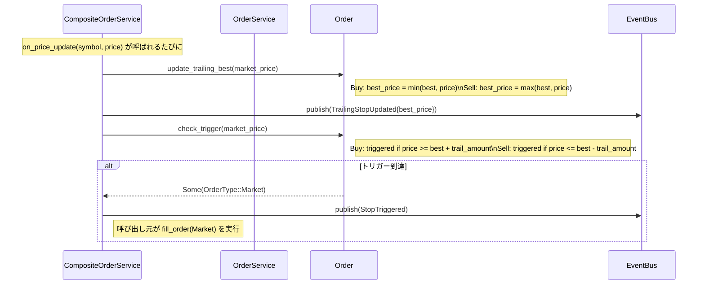
```mermaid
sequenceDiagram
    participant COMP as CompositeOrderService
    participant SVC as OrderService
    participant ORD as Order
    participant BUS as EventBus

    Note over COMP: on_price_update(symbol, price) が呼ばれるたびに

    COMP->>ORD: update_trailing_best(market_price)
    Note right of ORD: Buy:  best_price = min(best, price)\nSell: best_price = max(best, price)
    COMP->>BUS: publish(TrailingStopUpdated{best_price})

    COMP->>ORD: check_trigger(market_price)
    Note right of ORD: Buy:  triggered if price >= best + trail_amount\nSell: triggered if price <= best - trail_amount

    alt トリガー到達
        ORD-->>COMP: Some(OrderType::Market)
        COMP->>BUS: publish(StopTriggered)
        Note right of COMP: 呼び出し元が fill_order(Market) を実行
    end
```

---

## 6. IFD（If Done）複合注文フロー

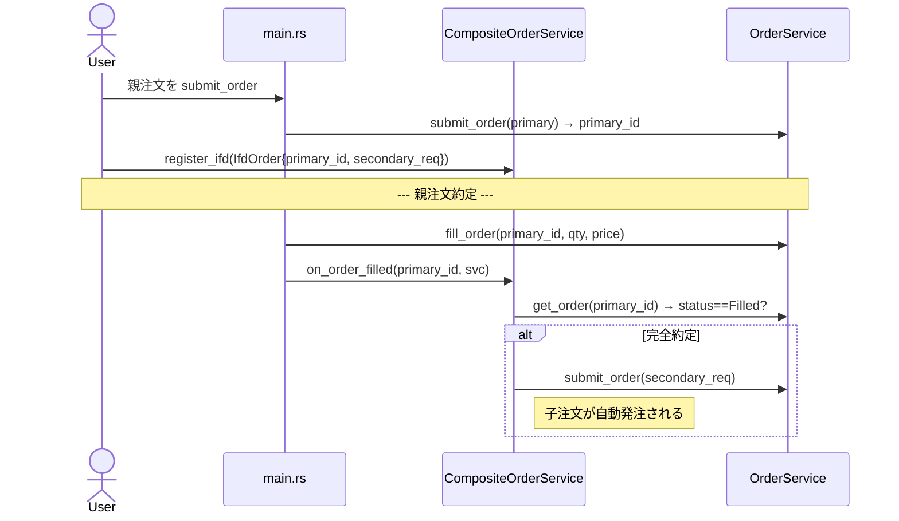
```mermaid
sequenceDiagram
    actor User
    participant CLI as main.rs
    participant COMP as CompositeOrderService
    participant SVC as OrderService

    User->>CLI: 親注文を submit_order
    CLI->>SVC: submit_order(primary) → primary_id
    User->>COMP: register_ifd(IfdOrder{primary_id, secondary_req})

    Note over User,SVC: --- 親注文約定 ---

    CLI->>SVC: fill_order(primary_id, qty, price)
    CLI->>COMP: on_order_filled(primary_id, svc)
    COMP->>SVC: get_order(primary_id) → status==Filled?
    alt 完全約定
        COMP->>SVC: submit_order(secondary_req)
        Note right of COMP: 子注文が自動発注される
    end
```

---

## 7. OCO（One-Cancels-Other）複合注文フロー

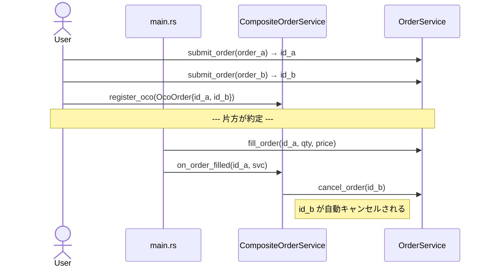
```mermaid
sequenceDiagram
    actor User
    participant CLI as main.rs
    participant COMP as CompositeOrderService
    participant SVC as OrderService

    User->>SVC: submit_order(order_a) → id_a
    User->>SVC: submit_order(order_b) → id_b
    User->>COMP: register_oco(OcoOrder{id_a, id_b})

    Note over User,SVC: --- 片方が約定 ---

    CLI->>SVC: fill_order(id_a, qty, price)
    CLI->>COMP: on_order_filled(id_a, svc)
    COMP->>SVC: cancel_order(id_b)
    Note right of COMP: id_b が自動キャンセルされる
```

---

## 8. 証拠金監視・ロスカットフロー

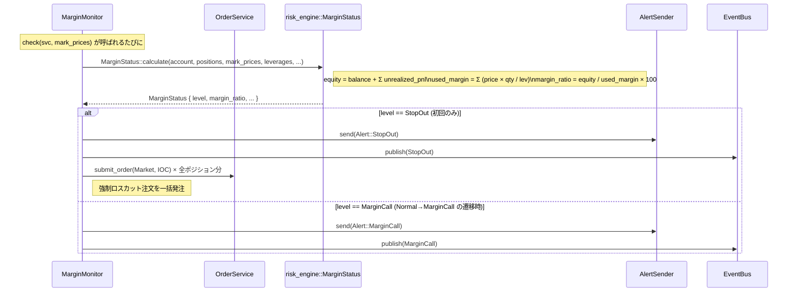
```mermaid
sequenceDiagram
    participant Monitor as MarginMonitor
    participant SVC as OrderService
    participant ENGINE as risk_engine::MarginStatus
    participant ALERT as AlertSender
    participant BUS as EventBus

    Note over Monitor: check(svc, mark_prices) が呼ばれるたびに

    Monitor->>ENGINE: MarginStatus::calculate(account, positions, mark_prices, leverages, ...)
    Note right of ENGINE: equity = balance + Σ unrealized_pnl\nused_margin = Σ (price × qty / lev)\nmargin_ratio = equity / used_margin × 100

    ENGINE-->>Monitor: MarginStatus { level, margin_ratio, ... }

    alt level == StopOut (初回のみ)
        Monitor->>ALERT: send(Alert::StopOut)
        Monitor->>BUS: publish(StopOut)
        Monitor->>SVC: submit_order(Market, IOC) × 全ポジション分
        Note right of Monitor: 強制ロスカット注文を一括発注
    else level == MarginCall (Normal→MarginCall の遷移時)
        Monitor->>ALERT: send(Alert::MarginCall)
        Monitor->>BUS: publish(MarginCall)
    end
```

**証拠金計算式:**
```
equity            = balance + Σ unrealized_pnl
used_margin       = Σ (mark_price × qty / leverage)
free_margin       = equity − used_margin
margin_ratio (%)  = equity / used_margin × 100
effective_leverage = Σ (mark_price × qty) / equity
```

**ロスカット発動水準デフォルト値:**

| 水準           | デフォルト | 説明                     |
|:-------------|:--------:|:-----------------------|
| 追証（MarginCall） | 100%  | アラート送信のみ            |
| ロスカット（StopOut） | 50%  | 全ポジション強制クローズ     |

---

## 9. 注文キャンセルフロー

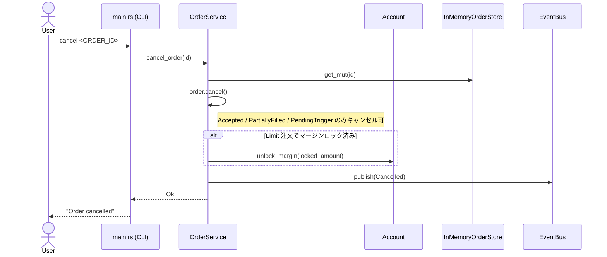
```mermaid
sequenceDiagram
    actor User
    participant CLI as main.rs (CLI)
    participant SVC as OrderService
    participant ACC as Account
    participant STORE as InMemoryOrderStore
    participant BUS as EventBus

    User->>CLI: cancel <ORDER_ID>
    CLI->>SVC: cancel_order(id)
    SVC->>STORE: get_mut(id)
    SVC->>SVC: order.cancel()
    Note right of SVC: Accepted / PartiallyFilled / PendingTrigger のみキャンセル可

    alt Limit 注文でマージンロック済み
        SVC->>ACC: unlock_margin(locked_amount)
    end

    SVC->>BUS: publish(Cancelled)
    SVC-->>CLI: Ok
    CLI-->>User: "Order cancelled"
```

---

## 10. ポジション更新フロー

約定時に `update_position_with_pnl` が呼ばれ、ネッティング方式でポジションを管理します。

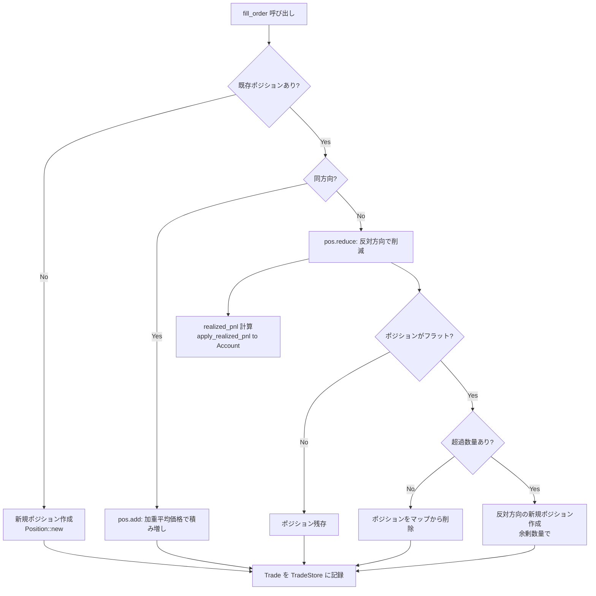
```mermaid
flowchart TD
    A[fill_order 呼び出し] --> B{既存ポジションあり?}

    B -- No --> C[新規ポジション作成\nPosition::new]
    B -- Yes --> D{同方向?}

    D -- Yes --> E[pos.add: 加重平均価格で積み増し]
    D -- No --> F[pos.reduce: 反対方向で削減]

    F --> G[realized_pnl 計算\napply_realized_pnl to Account]
    F --> H{ポジションがフラット?}

    H -- No --> I[ポジション残存]
    H -- Yes --> J{超過数量あり?}

    J -- No --> K[ポジションをマップから削除]
    J -- Yes --> L[反対方向の新規ポジション作成\n余剰数量で]

    C & E & I & K & L --> M[Trade を TradeStore に記録]
```

**実現損益の計算式：**
- **Long ポジション（Buy）**: `(fill_price - avg_price) × close_qty`
- **Short ポジション（Sell）**: `(avg_price - fill_price) × close_qty`

---

## 11. 証拠金ライフサイクル

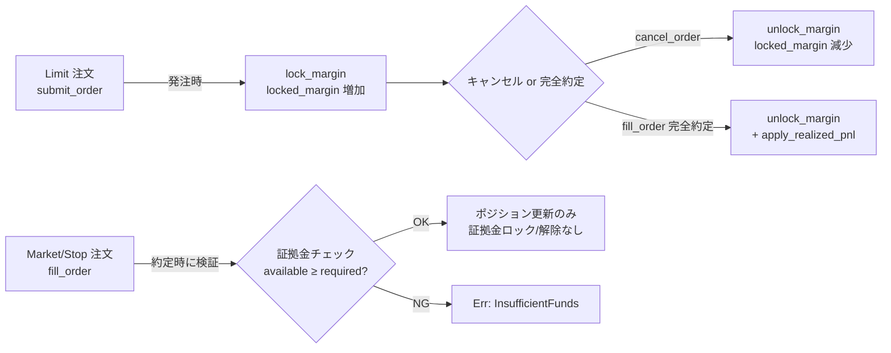
```mermaid
flowchart LR
    A[Limit 注文\nsubmit_order] -->|発注時| B[lock_margin\nlocked_margin 増加]
    B --> C{キャンセル or 完全約定}
    C -->|cancel_order| D[unlock_margin\nlocked_margin 減少]
    C -->|fill_order 完全約定| E[unlock_margin\n+ apply_realized_pnl]

    F[Market/Stop 注文\nfill_order] -->|約定時に検証| G{証拠金チェック\navailable ≥ required?}
    G -->|OK| H[ポジション更新のみ\n証拠金ロック/解除なし]
    G -->|NG| I[Err: InsufficientFunds]
```

---

## 12. CLI / REPL コマンドフロー

```
cargo run -- [command]
                │
                ├── submit    → handle_submit   → SVC.submit_order
                ├── list      → handle_list     → SVC.get_open_orders
                ├── cancel    → handle_cancel   → SVC.cancel_order
                ├── fill      → handle_fill     → SVC.fill_order
                ├── account   → handle_account  → SVC.get_account
                ├── positions → handle_positions → SVC.get_positions
                ├── history   → handle_history  → SVC.get_trade_history
                ├── margin    → handle_margin   → MarginStatus::calculate
                └── repl      → run_repl (インタラクティブループ)
                     └── 上記コマンドを対話的に実行
```

**新コマンドの使用例：**
```bash
# 約定履歴表示
cargo run -- history
cargo run -- history --instrument BTC/USD

# 証拠金ステータス（市場価格を SYMBOL:PRICE 形式で指定）
cargo run -- margin --price BTC/USD:67000 --price USD/JPY:152

# REPL
aegis> history BTC/USD
aegis> margin BTC/USD:67000 USD/JPY:152
```


## 1. 注文ステートマシン

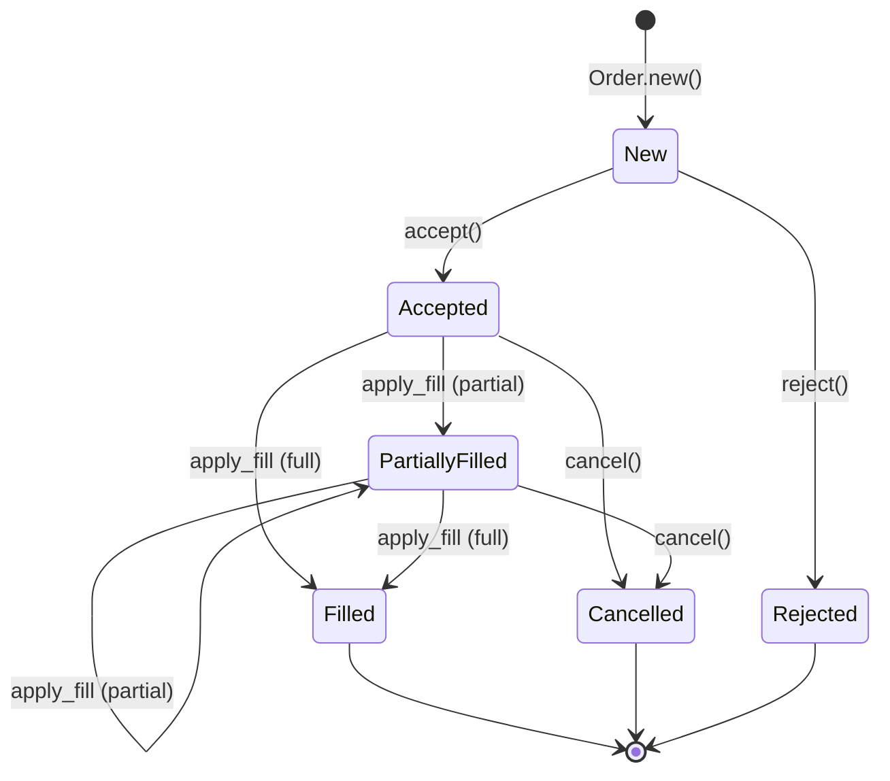
```mermaid
stateDiagram-v2
    [*] --> New : Order.new()
    New --> Accepted : accept()
    New --> Rejected : reject()
    Accepted --> PartiallyFilled : apply_fill (partial)
    Accepted --> Filled : apply_fill (full)
    Accepted --> Cancelled : cancel()
    PartiallyFilled --> PartiallyFilled : apply_fill (partial)
    PartiallyFilled --> Filled : apply_fill (full)
    PartiallyFilled --> Cancelled : cancel()
    Filled --> [*]
    Cancelled --> [*]
    Rejected --> [*]
```

---

## 2. Limit 注文フロー（発注 → 約定）

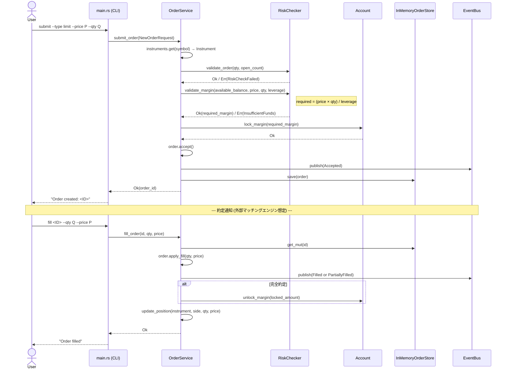
```mermaid
sequenceDiagram
    actor User
    participant CLI as main.rs (CLI)
    participant SVC as OrderService
    participant RISK as RiskChecker
    participant ACC as Account
    participant STORE as InMemoryOrderStore
    participant BUS as EventBus

    User->>CLI: submit --type limit --price P --qty Q
    CLI->>SVC: submit_order(NewOrderRequest)

    SVC->>SVC: instruments.get(symbol) → Instrument
    SVC->>RISK: validate_order(qty, open_count)
    RISK-->>SVC: Ok / Err(RiskCheckFailed)

    SVC->>RISK: validate_margin(available_balance, price, qty, leverage)
    Note right of RISK: required = (price × qty) / leverage
    RISK-->>SVC: Ok(required_margin) / Err(InsufficientFunds)

    SVC->>ACC: lock_margin(required_margin)
    ACC-->>SVC: Ok

    SVC->>SVC: order.accept()
    SVC->>BUS: publish(Accepted)
    SVC->>STORE: save(order)
    SVC-->>CLI: Ok(order_id)
    CLI-->>User: "Order created: <ID>"

    Note over User,BUS: --- 約定通知 (外部マッチングエンジン想定) ---

    User->>CLI: fill <ID> --qty Q --price P
    CLI->>SVC: fill_order(id, qty, price)
    SVC->>STORE: get_mut(id)
    SVC->>SVC: order.apply_fill(qty, price)
    SVC->>BUS: publish(Filled or PartiallyFilled)

    alt 完全約定
        SVC->>ACC: unlock_margin(locked_amount)
    end

    SVC->>SVC: update_position(instrument, side, qty, price)
    SVC-->>CLI: Ok
    CLI-->>User: "Order filled"
```

---

## 3. Market 注文フロー（発注 → 約定）

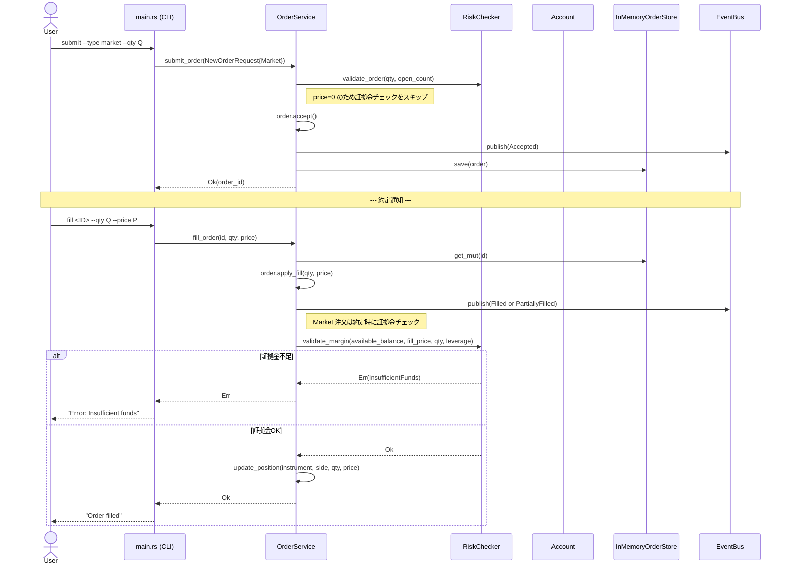
```mermaid
sequenceDiagram
    actor User
    participant CLI as main.rs (CLI)
    participant SVC as OrderService
    participant RISK as RiskChecker
    participant ACC as Account
    participant STORE as InMemoryOrderStore
    participant BUS as EventBus

    User->>CLI: submit --type market --qty Q
    CLI->>SVC: submit_order(NewOrderRequest{Market})

    SVC->>RISK: validate_order(qty, open_count)
    Note right of SVC: price=0 のため証拠金チェックをスキップ
    SVC->>SVC: order.accept()
    SVC->>BUS: publish(Accepted)
    SVC->>STORE: save(order)
    SVC-->>CLI: Ok(order_id)

    Note over User,BUS: --- 約定通知 ---

    User->>CLI: fill <ID> --qty Q --price P
    CLI->>SVC: fill_order(id, qty, price)
    SVC->>STORE: get_mut(id)
    SVC->>SVC: order.apply_fill(qty, price)
    SVC->>BUS: publish(Filled or PartiallyFilled)

    Note right of SVC: Market 注文は約定時に証拠金チェック
    SVC->>RISK: validate_margin(available_balance, fill_price, qty, leverage)
    alt 証拠金不足
        RISK-->>SVC: Err(InsufficientFunds)
        SVC-->>CLI: Err
        CLI-->>User: "Error: Insufficient funds"
    else 証拠金OK
        RISK-->>SVC: Ok
        SVC->>SVC: update_position(instrument, side, qty, price)
        SVC-->>CLI: Ok
        CLI-->>User: "Order filled"
    end
```

---

## 4. 注文キャンセルフロー

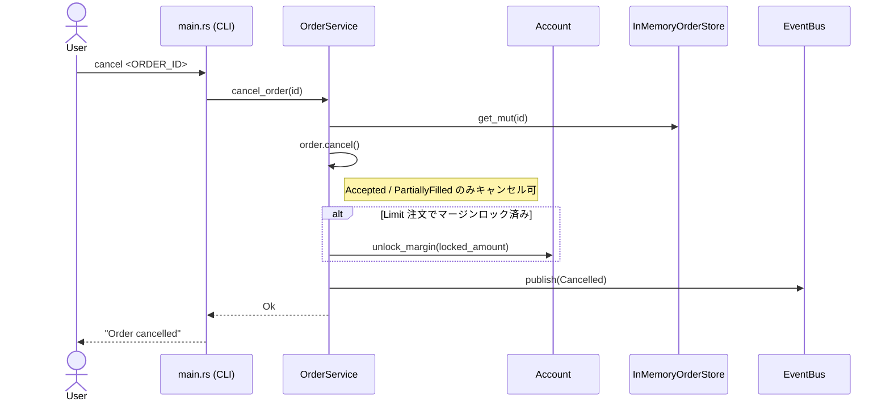
```mermaid
sequenceDiagram
    actor User
    participant CLI as main.rs (CLI)
    participant SVC as OrderService
    participant ACC as Account
    participant STORE as InMemoryOrderStore
    participant BUS as EventBus

    User->>CLI: cancel <ORDER_ID>
    CLI->>SVC: cancel_order(id)
    SVC->>STORE: get_mut(id)
    SVC->>SVC: order.cancel()
    Note right of SVC: Accepted / PartiallyFilled のみキャンセル可

    alt Limit 注文でマージンロック済み
        SVC->>ACC: unlock_margin(locked_amount)
    end

    SVC->>BUS: publish(Cancelled)
    SVC-->>CLI: Ok
    CLI-->>User: "Order cancelled"
```

---

## 5. ポジション更新フロー

約定時に `update_position` が呼ばれ、ネッティング方式でポジションを管理します。

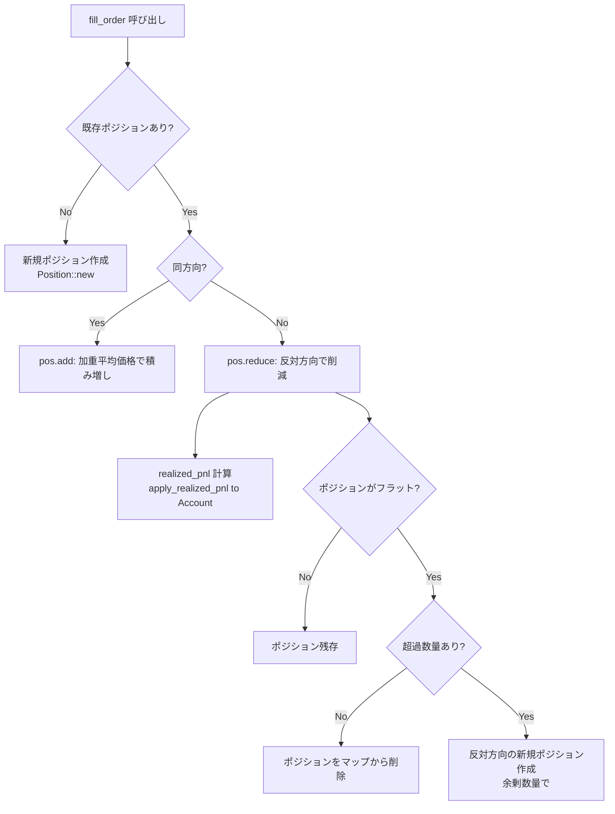
```mermaid
flowchart TD
    A[fill_order 呼び出し] --> B{既存ポジションあり?}

    B -- No --> C[新規ポジション作成\nPosition::new]
    B -- Yes --> D{同方向?}

    D -- Yes --> E[pos.add: 加重平均価格で積み増し]
    D -- No --> F[pos.reduce: 反対方向で削減]

    F --> G[realized_pnl 計算\napply_realized_pnl to Account]
    F --> H{ポジションがフラット?}

    H -- No --> I[ポジション残存]
    H -- Yes --> J{超過数量あり?}

    J -- No --> K[ポジションをマップから削除]
    J -- Yes --> L[反対方向の新規ポジション作成\n余剰数量で]
```

**実現損益の計算式：**
- **Long ポジション（Buy）**: `(fill_price - avg_price) × close_qty`
- **Short ポジション（Sell）**: `(avg_price - fill_price) × close_qty`

---

## 6. 証拠金ライフサイクル

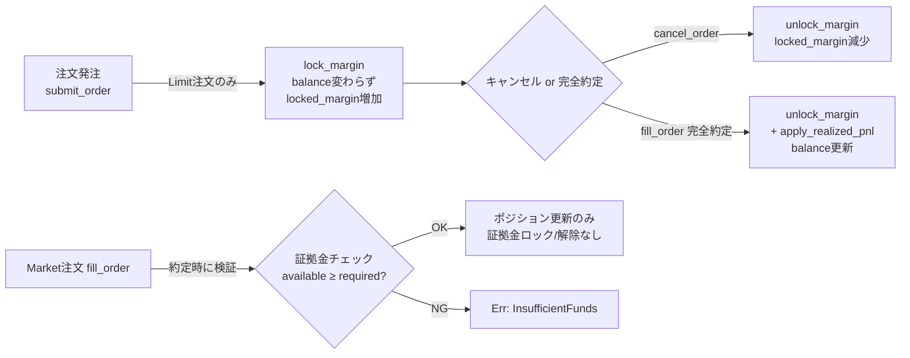
```mermaid
flowchart LR
    A[注文発注\nsubmit_order] -->|Limit注文のみ| B[lock_margin\nbalance変わらず\nlocked_margin増加]
    B --> C{キャンセル or 完全約定}
    C -->|cancel_order| D[unlock_margin\nlocked_margin減少]
    C -->|fill_order 完全約定| E[unlock_margin\n+ apply_realized_pnl\nbalance更新]

    F[Market注文 fill_order] -->|約定時に検証| G{証拠金チェック\navailable ≥ required?}
    G -->|OK| H[ポジション更新のみ\n証拠金ロック/解除なし]
    G -->|NG| I[Err: InsufficientFunds]
```

---

## 7. 含み損益の更新フロー

`unrealized_pnl` は自動更新されません。呼び出し元が市場価格を提供する必要があります。

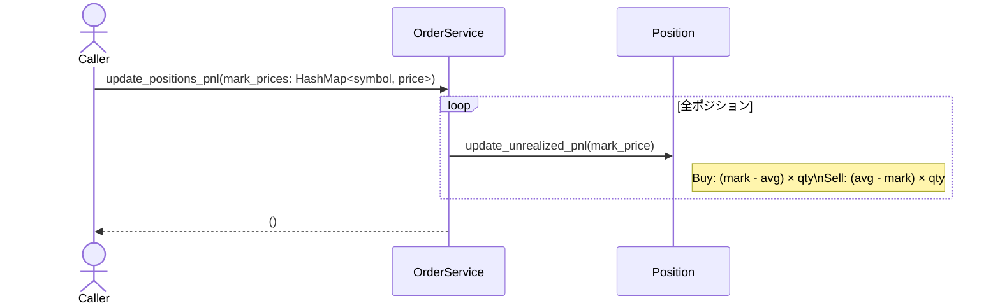
```mermaid
sequenceDiagram
    actor Caller
    participant SVC as OrderService
    participant POS as Position

    Caller->>SVC: update_positions_pnl(mark_prices: HashMap<symbol, price>)
    loop 全ポジション
        SVC->>POS: update_unrealized_pnl(mark_price)
        Note right of POS: Buy:  (mark - avg) × qty\nSell: (avg - mark) × qty
    end
    SVC-->>Caller: ()
```

---

## 8. CLI / REPL コマンドフロー

```
cargo run -- [command]
                │
                ├── submit   → handle_submit → SVC.submit_order
                ├── list     → handle_list   → SVC.get_open_orders
                ├── cancel   → handle_cancel → SVC.cancel_order
                ├── fill     → handle_fill   → SVC.fill_order
                ├── account  → handle_account → SVC.get_account
                ├── positions → handle_positions → SVC.get_positions
                └── repl     → run_repl (インタラクティブループ)
                     └── 上記コマンドを対話的に実行
```
